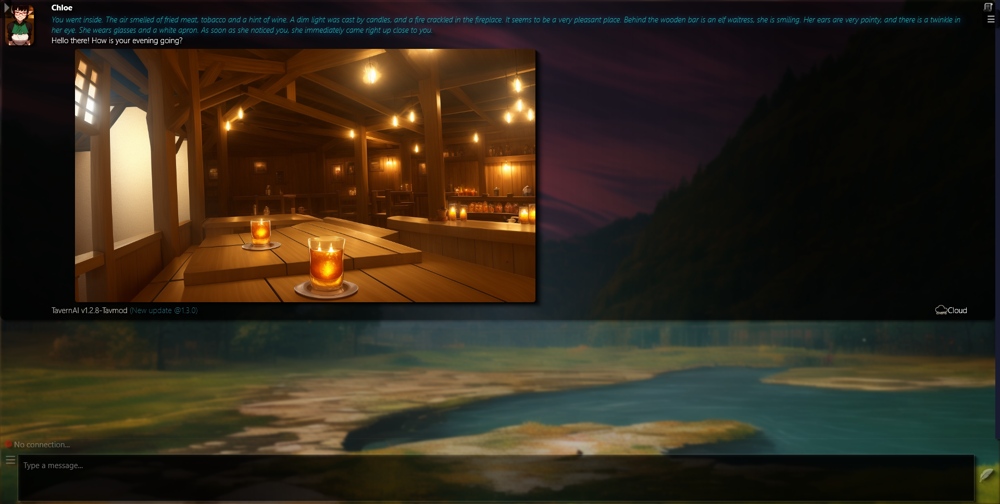
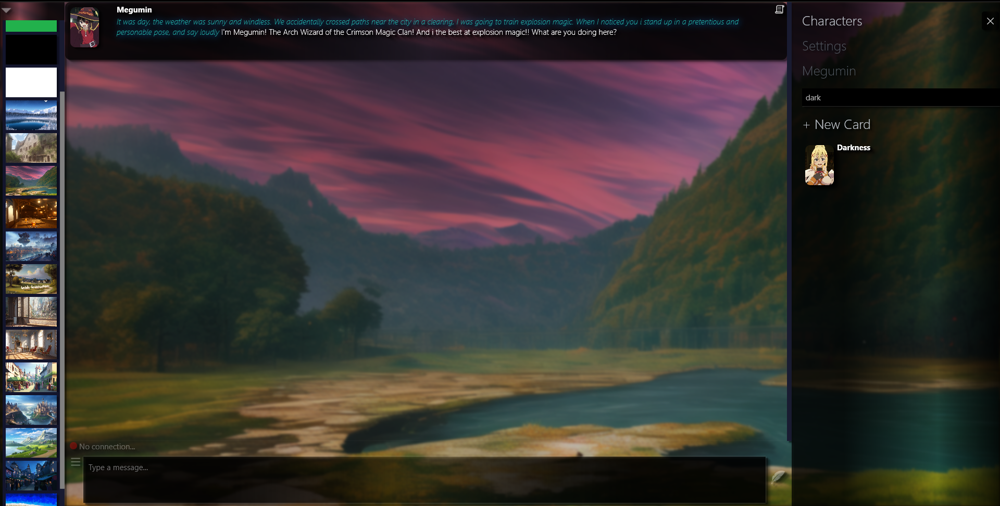

### Tavmod is a modification of [CNCanon1's fork of 1.2.8 TavernAI](https://github.com/CncAnon1/TavernAITurbo)

### [original Tavernai](https://github.com/TavernAI/TavernAI)

## Notable modifications
* Alphabet sort (apparently this is supposed to break something on normal tav? but seems to work without issue)
* auto connect to last used API
* Auto open last interacted character
* Dynamic resizing of chatbox to fit screen if background / character menu is opened
* searchbox for characters
* fixed going past the bounds of the window (no double scrollbars)
* background selector now actually goes to the bottom of the screen
* background shuffler (5 minutes)
* chloe actually uses 'tavern.png' as her introductory message instead of 'stardust city.png'
* css overhaul

exmaple images (maybe outdated)

